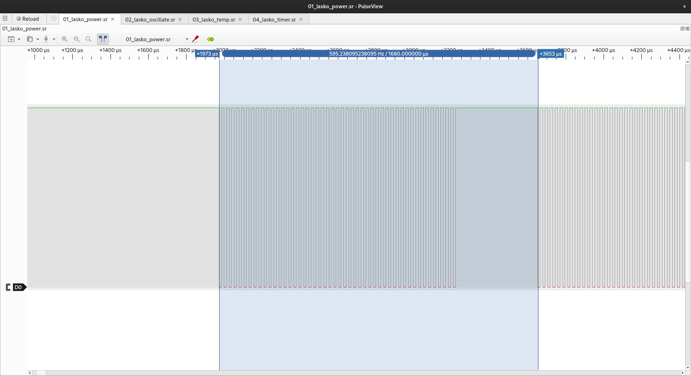

# Lasko IR Remote

A cloned IR remote to control a Lasko pedestal fan.

# Signal Decoding
The remote sends signals to the fan using an infrared LED. This IR LED is connected to the GPIO of a microcontroller so that when the GPIO pin is pulled low the IR LED is turned on.

## Carrier Frequency

The IR LED sends the signals using a carrier frequency of 38kHz. This seems to be a popular frequency for most consumer IR remotes. Bits are sent as a duration of pulsing the IR LED at the carrier frequency followed by a period of no IR. All bits are 1680us long.

## Signal Bit Value of One

I'm calling the above bit as having a value of `one`. I have no way of knowing if the remote and fan consider this value to be a `one` but it doesn't matter since this designation is used only as a shortcut in my firmware to encode the signals. This bit is 1680us long with 1246us of IR LED pulsing followed by no IR for the remainder of the bit.

## Signal Bit Value of Zero

The above bit has a value of `zero`. Again this bit is 1680us long with 404us of IR LED pulsing followed by no IR for the remainder of the bit.

## Power Signal

The remote strings together the `one` and `zero` bit values to send out commands. Following the bit value convention outlined above the logic capture of the power signal is `0b110110000001`. All signals are 12 bits long and repeat 4 times with a delay of 7107us between repeats. The power signal from the remote will turn on the fan if it is off and decrement through the four fan speeds with each press until turning the fan is off again.

## Oscillate Signal

The oscillate signal is `0b110110000010`. The oscillate signal will enable and disable the oscillation of the fan.

## Temperature Signal

The temperature signal is `0b110110010000`. This signal is used to set a turn off temperature for the fan from 60F to 80F in 5F increments. If the ambient temperature drops below this setting the fan will turn off.

## Timer Signal

The timer signal is `0b110110001000`. This signal sets a timer to turn the fan off. Interestingly the timer value is displayed as a binary value. There are LEDs for 1, 2, and 4 hours on the fan. By pressing the timer button the timer will increment from 1 to 7 hours.

# Schematic
There is nothing ground breaking about the circuit I came up with. The heavy lifting is done using my favorite microcontroller for small projects, the Attiny212. The hardest part about this circuit was finding what IR LED to use, I found 940nm to be the correct wavelength.

# Firmware
The microcontroller spends much of its time asleep to save power. All four buttons are used as an interrupt to wake the Attiny212. The carrier frequency is generated using Timer A on the Attiny212. The timer ISR will toggle the IR LED for the required duration and then the IR LED will be turned off for the remainder of the bit. Again to save power the Attiny212 is allowed to sleep in between pulses. The full code can be found here: [firmware/scr/main.cpp](firmware/scr/main.cpp)

# PCB
Since I only wanted to make two extra remotes I decided to make the PCBs at home using my [CNC 3018 pro mill](https://samueldperry.com/cnc-3018-pro-router/).

# Enclosure
For the enclosure I went with a 3D printed three piece design. The enclosure is held together with 10mm long M3 socket head bolts. I have threaded inserts to make battery changes easier.

# Conclusion
This was an easy project to make with the most difficult part being finding the correct wavelength of IR LED to use. I initially used a 850nm IR LED but I found that while the signal would be received by the fan, the remote had to be pointing directly at the fan and I had to be standing within arms reach for it to work. The 940nm IR LED was found to work much better.

The final hardest part of this project was that I completed this PCB and firmware about 6 months ago and only now have gotten around to writing this documentation up. I have forgotten much and have had to gloss over many of the details in this documentation.